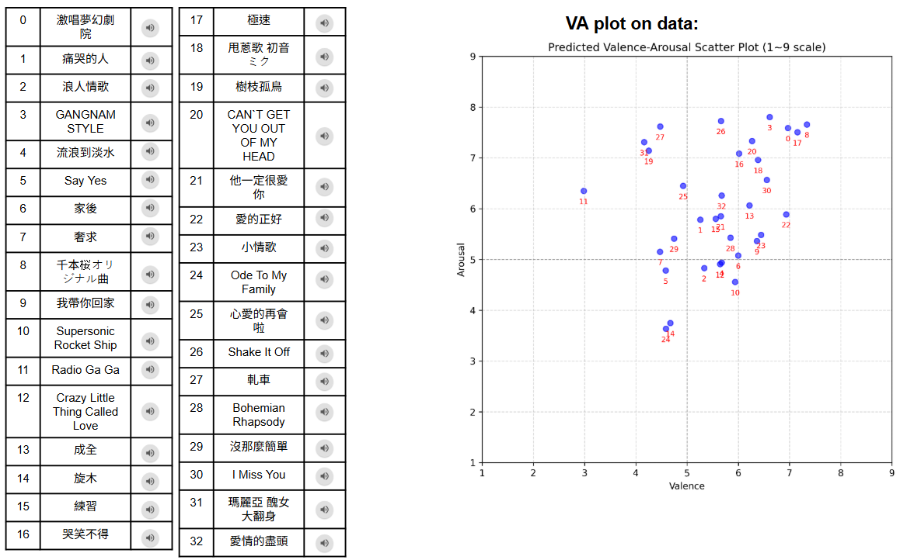

# Audio Valence-Arousal Predictor 
## Introduction
<p align="center">
  
</p>  
  
This project focuses on music emotion recognition through valence–arousal (VA) regression. We explore different approaches, starting from audio feature–based baselines using BEATs embeddings, and extend the framework with LLM support by leveraging lyric transcription. Our experiments highlight the limitations of existing open-source datasets and demonstrate the benefits of our Mood-series dataset, which provides more reliable valence annotations and results in more consistent VA distributions.

- Please see the slide for more descriptions and demo: [My Google Slide](https://docs.google.com/presentation/d/1O6-D0DZGffdyYIPhNtaUbJNti8UpV-1HFuG82ZAVm_c/edit?usp=sharing)

## Quick Start Guide
### Installation
Download BEATs feature extractor [pretraind weight](https://www.kaggle.com/datasets/hubfor/microsoft-beats-model).
This repo is debveloped using python version 3.8
```bash
git clone https://github.com/DCN2001/VA_predictor.git
cd VA_predictor
pip install -r requirements.txt
```
* Our code is built on pytorch version 2.4.1 (torch==2.4.1 in the requirements.txt). But you might need to choose the correct version of `torch` based on your CUDA version

### Training
#### **Preprocess**
```shell
cd dataset/preprocess
```
I. Feature extraction:  
Extract the feature of three public datasets: [DEAM dataset](https://www.kaggle.com/datasets/imsparsh/deam-mediaeval-dataset-emotional-analysis-in-music), [Emomusic dataset](https://cvml.unige.ch/databases/emoMusic/), [PMemo dataset](https://github.com/HuiZhangDB/PMEmo?tab=readme-ov-file), check out their website for downloading.
```shell
#For DEAM dataset
python DEAM_preprocess.py --datapath "your_data_path" --destpath "your_destination_path"
#For Emomusic dataset
python Emomusic_preprocess.py --datapath "your_data_path" --destpath "your_destination_path"
#For PMemo dataset
python PMemo_preprocess.py --datapath "your_data_path" --destpath "your_destination_path"
```
For the two private dataset, please contact to Nation Taiwan University [Music & Ai lab](https://affige.github.io/lab.html) for downloading.
```shell
#For AMG1838 dataset
python AMG1838_preprocess.py --datapath "your_data_path" --destpath "your_destination_path"
#For CH818 dataset
python CH818_preprocess.py --datapath "your_data_path" --destpath "your_destination_path"
```
#### **Start training**
After feature extraction, we can start training our Valence-Arousal regressive model.
```shell
cd ../..
```
Here you can decide the combination of the 5 datasets with **trainset_option**.  
Our **epochs** is set to 150 with **batch size** 64.
You should fill in the feature path of each dataset in the [config_va.py](./configs/config_va.py) or in the command.
```shell
python train_reg.py --trainset_option "DEP_only or M_only or DEPM" --DEAM_datapath "the path of extracted DEAM dataset feature" --Emomusic_datapath "the path of extracted Emomusic dataset feature"--PMemo_datapath "the path of extracted PMemo dataset feature" --Mood_datapath "the path of extracted Mood series dataset feature"
```

### Testing 
#### Feature extraction & lyrics acquisition
```shell
cd dataset/preprocess 
```
```shell
python testdata_preprocess.py --testpath "your testdata folder" --sample_path "30s sample save path" --feature_path "feature save path"
```
After getting the sample and its feature, start acquiring lyrics for LLM support.  
  * 1.Vocal part separation
    ```shell
    python sep.py --audio_dir "30s sample folder path" --vocal_dir "vocal save path"
    ```
  * 2.Lyrics transcript
    ```shell
    python transcript.py --vocal_dir "separated vocal folder path" --lyric_dir "lyrics save path"
    ```

#### **Testing w/o LLM**
```shell
python plot_testdata.py --feature_path "path of testdata feature" --model_path "path of model state" --plot_path "Path for saving the plot of testdata"
```
#### **Testing w/ LLM** 
```shell
python plot_test_gpt.py --feature_path "path of testdata feature" --lyrics_path "path of transcipted lyrics of your testdata" --plot_path "Path for saving the plot of testdata" --model_path "path of model state" --api_key "Enter your key for using OpenAI api"
```